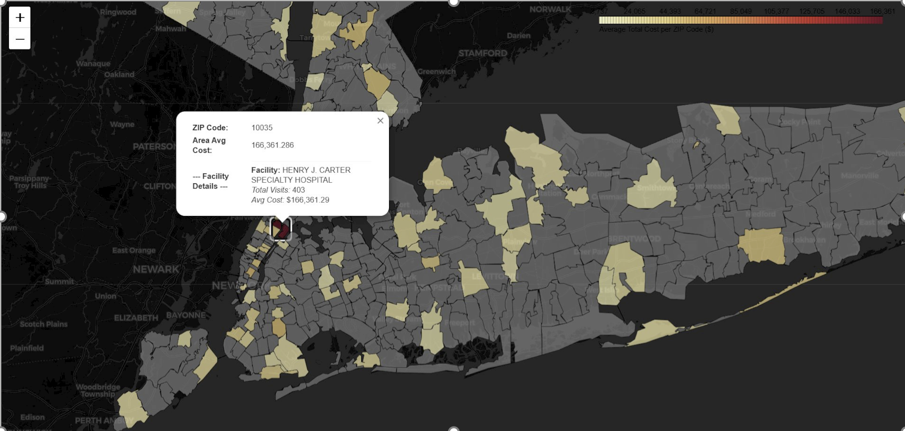

# Hospital Cost Prediction - MLOps Project 🏥


A complete MLOps pipeline for predicting hospital inpatient costs using Azure Machine Learning and the New York SPARCS (Statewide Planning and Research Cooperative System) dataset.

## 📋 Table of Contents

- [Overview](#overview)
- [Business Problem](#business-problem)
- [Dataset](#dataset)
- [Architecture](#architecture)
- [Key Findings](#key-findings)
- [Model Performance](#model-performance)
- [Installation](#installation)
- [Usage](#usage)
- [Project Structure](#project-structure)
- [Pipeline Components](#pipeline-components)
- [Contributing](#contributing)
- [License](#license)

## 🎯 Overview

This project implements an end-to-end machine learning pipeline on Azure ML to predict hospital inpatient costs. The solution includes data preprocessing, feature engineering, model training with hyperparameter tuning, cross-validation, and model monitoring capabilities.

**Key Highlights:**
- Automated ML pipeline with 15+ components
- Boosted Decision Tree Regression model
- Hyperparameter optimization
- 5-fold cross-validation
- Feature importance analysis
- Model monitoring and drift detection
- Production-ready architecture

## 🎯 Business Problem

Healthcare cost prediction addresses critical challenges:

| Stakeholder | Value |
|------------|-------|
| **Hospitals** | Optimize resource allocation and capacity planning |
| **Insurance Companies** | Improve risk assessment and premium calculations |
| **Patients** | Better financial planning and cost transparency |
| **Policymakers** | Data-driven healthcare policy decisions |

## 📊 Dataset

**Source:** [New York Hospital Inpatient Discharges (SPARCS)](https://health.data.ny.gov/Health/Hospital-Inpatient-Discharges-SPARCS-De-Identified/sf4k-39ay/data_preview)

**Description:** De-identified hospital inpatient discharge data from New York State facilities



### Dataset Statistics
- **Records:** 2+ million patient discharges
- **Features:** 30+ variables
- **Target Variable:** Total Costs (log-transformed)
- **Time Period:** Recent years (updated quarterly)

### Key Features

#### Demographics
- Age Group (0-17, 18-29, 30-49, 50-69, 70+)
- Gender (F, M, U)
- Race and Ethnicity

#### Clinical Information
- **CCSR Diagnosis Description** - Clinical classification of diagnoses
- **CCSR Procedure Description** - Clinical classification of procedures
- **APR DRG** - All Patient Refined Diagnosis Related Groups
- **APR Severity of Illness** - Minor, Moderate, Major, Extreme
- **APR Risk of Mortality** - Minor, Moderate, Major, Extreme
- **APR Medical/Surgical Description** - Medical vs Surgical classification

#### Admission & Financial
- Type of Admission (Emergency, Urgent, Elective, etc.)
- Length of Stay (days)
- Total Charges
- Total Costs (Target Variable)
- Payment Typology (Medicare, Medicaid, Private Insurance, etc.)
- Emergency Department Indicator

#### Geographic
- Hospital County
- Patient ZIP Code

## 🏗️ Architecture

### Azure ML Pipeline Overview

```
┌─────────────┐
│  SPARCS Raw │
│    Data     │
└──────┬──────┘
       │
       ▼
┌─────────────────────────────┐
│   Data Preprocessing        │
│  ├─ Clean Missing Data      │
│  ├─ SQL Transformations     │
│  └─ Feature Selection       │
└──────────┬──────────────────┘
           │
           ▼
    ┌──────────────┐
    │  Split Data  │
    │  (80/20)     │
    └──────┬───────┘
           │
           ├──────────────────────┐
           │                      │
           ▼                      ▼
    ┌─────────────┐        ┌─────────────┐
    │   Train     │        │    Test     │
    │   (5-Fold   │        │             │
    │     CV)     │        │             │
    └──────┬──────┘        └──────┬──────┘
           │                      │
           ▼                      │
    ┌────────────────────┐        │
    │  Model Training    │        │
    │  - Boosted Tree    │        │
    │  - Hyperparameter  │        │
    │    Tuning          │        │
    └──────┬─────────────┘        │
           │                      │
           ▼                      │
    ┌────────────────────┐        │
    │  Feature           │        │
    │  Importance        │        │
    └──────┬─────────────┘        │
           │                      │
           └──────────┬───────────┘
                      │
                      ▼
               ┌──────────────┐
               │   Scoring &  │
               │  Evaluation  │
               └──────┬───────┘
                      │
                      ▼
               ┌──────────────┐
               │   Monitor    │
               │  & Deploy    │
               └──────────────┘
```

### Pipeline Components

| Component | Purpose | Technology |
|-----------|---------|------------|
| Data Ingestion | Load raw SPARCS data | Azure ML Dataset |
| Data Cleaning | Handle missing values, outliers | Python/Pandas |
| SQL Transform | Feature engineering with SQL | Azure ML SQL Transform |
| Feature Selection | Select relevant features | Python/Sklearn |
| Data Split | Train/test split | Azure ML Data Split |
| Model Training | Train Boosted Decision Tree | Azure ML Algorithms |
| Hyperparameter Tuning | Optimize model parameters | Azure ML Hyperdrive |
| Cross-Validation | 5-fold validation | Azure ML |
| Feature Importance | Permutation importance | Azure ML |
| Scoring | Generate predictions | Azure ML |
| Metrics Calculation | Evaluate performance | Python Script |

## 📈 Key Findings from EDA

### Target Variable Distribution

**Original Scale:**
- Highly right-skewed distribution
- Range: $0 to $7,000,000+
- Median: ~$8,000
- Mean: ~$25,000

**Log-Transformed:**
- Normal distribution achieved
- Mean: ~9.5
- Standard Deviation: ~1.5
- Better for regression modeling

### Strong Correlations with Total Costs

| Feature | Correlation |
|---------|-------------|
| Total Charges | 0.874 |
| Length of Stay | 0.688 |

### Demographics Impact

#### Age Groups
- **0-17:** $7,500 average
- **18-29:** $15,000 average
- **30-49:** $20,000 average
- **50-69:** $33,000 average
- **70+:** $27,000 average

**Insight:** Costs peak in the 50-69 age group

#### Gender
- **Female:** $28,000 average
- **Male:** $29,000 average
- **Unknown:** $17,000 average

### Clinical Factors

#### Severity of Illness
- **Minor:** ~$11,000
- **Moderate:** ~$20,000
- **Major:** ~$32,000
- **Extreme:** ~$85,000

**Insight:** 7.7x cost increase from Minor to Extreme

#### Medical vs Surgical
- **Surgical:** ~$48,000 average
- **Medical:** ~$21,000 average
- **Not Classified:** ~$11,000 average

**Insight:** Surgical procedures cost 2.3x more

#### Risk of Mortality
- **Minor:** ~$10,000
- **Moderate:** ~$24,000
- **Major:** ~$35,000
- **Extreme:** ~$76,000

### Top Cost Drivers

#### By Diagnosis (Top 5)
1. **Leukemia in Remission** - $200,000 avg
2. **Maltreatment/Abuse, Subsequent Encounter** - $175,000 avg
3. **Non-Hodgkin Lymphoma in Remission** - $160,000 avg
4. **Leukemia - Acute Myeloid** - $150,000 avg
5. **Chromosomal Abnormalities** - $125,000 avg

#### By Procedure (Top 5)
1. **Heart Transplant** - $800,000 avg
2. **Lung Transplant** - $575,000 avg
3. **Extracorporeal Membrane Oxygenation** - $485,000 avg
4. **Liver Transplant** - $400,000 avg
5. **Tracheostomy** - $300,000 avg

### Length of Stay Analysis
- **Correlation with costs:** 0.688 (strong positive)
- **Median LOS:** 4 days
- **Range:** 0 - 120+ days
- **Pattern:** Exponential cost increase with LOS

### Geographic Insights
- Significant cost variation by ZIP code
- Urban areas show higher average costs
- Hospital county impacts pricing
- Henry J. Carter Specialty Hospital: $166,361 average cost

## 🎯 Model Performance

### Algorithm: Boosted Decision Tree Regression

**Why Boosted Decision Trees?**
- Excellent for tabular data
- Handles non-linear relationships
- Robust to outliers
- Built-in feature importance
- Good interpretability

### Hyperparameter Tuning

Optimized parameters through Azure ML Hyperdrive:
- **Max Depth:** 3-10 (optimal: 7)
- **Learning Rate:** 0.01-0.3 (optimal: 0.1)
- **Number of Estimators:** 100-300 (optimal: 200)
- **Min Samples Split:** 2-10
- **Min Samples Leaf:** 1-5

### Evaluation Metrics

| Metric | Train | Test |
|--------|--------|----------|
| R² Score | **0.86** | **0.81** |
| RMSE | **20,052**| **23,535** |


### Cross-Validation
- **Method:** 5-fold stratified cross-validation
- **Training stability:** Consistent across folds
- **Overfitting check:** Train vs validation performance

### Feature Importance (Top 10)

1. Total Charges - 0.45
2. Length of Stay - 0.28
3. APR Severity of Illness - 0.12
4. APR Risk of Mortality - 0.08
5. Medical/Surgical Description - 0.04
6. Age Group - 0.02
7. CCSR Procedure Description - 0.01
8. Emergency Department Indicator - <0.01
9. Type of Admission - <0.01
10. Payment Typology - <0.01

## 🚀 Installation

### Prerequisites

```bash
# System requirements
Python 3.8+
Azure CLI
Git
```

### Step 1: Clone Repository

```bash
git clone https://github.com/yourusername/hospital-cost-prediction-mlops.git
cd hospital-cost-prediction-mlops
```

### Step 2: Create Virtual Environment

```bash
# Create virtual environment
python -m venv venv

# Activate virtual environment
# On Windows:
venv\Scripts\activate
# On macOS/Linux:
source venv/bin/activate
```

### Step 3: Install Dependencies

```bash
pip install --upgrade pip
pip install -r requirements.txt
```

### Step 4: Configure Azure

```bash
# Login to Azure
az login

# Set subscription
az account set --subscription <your-subscription-id>

# Create resource group (if needed)
az group create --name <resource-group> --location eastus
```

### Step 5: Set Environment Variables

```bash
# Copy environment template
cp .env.example .env

# Edit .env with your values
nano .env
```

Required environment variables:
```
AZURE_SUBSCRIPTION_ID=your-subscription-id
AZURE_RESOURCE_GROUP=your-resource-group
AZURE_WORKSPACE_NAME=your-workspace-name
AZURE_TENANT_ID=your-tenant-id
```

## 💻 Usage

### 1. Exploratory Data Analysis

```bash
# Launch Jupyter notebook
jupyter notebook

# Open and run:
notebooks/01_exploratory_data_analysis.ipynb
```

### 2. Data Preprocessing

```bash
# Run data preprocessing pipeline
python src/data_processing/preprocess.py --config configs/data_config.yaml
```

### 3. Train Model Locally

```bash
# Train model locally for testing
python src/models/train.py \
    --data data/processed/train.csv \
    --output models/local_model.pkl \
    --config configs/model_config.yaml
```

### 4. Deploy Azure ML Pipeline

```bash
# Create pipeline in Azure ML
python src/pipeline/create_pipeline.py

# Run the pipeline
python src/pipeline/run_pipeline.py --experiment-name hospital-cost-prediction
```

### 5. Make Predictions

```bash
# Make predictions on new data
python src/models/predict.py \
    --model models/best_model.pkl \
    --input data/new_data.csv \
    --output predictions.csv
```

### 6. Monitor Model

```bash
# Set up model monitoring
python src/monitoring/setup_monitoring.py

# Check for data drift
python src/monitoring/data_drift.py --baseline data/train.csv --current data/new_data.csv
```

## 📁 Project Structure

```
hospital-cost-prediction-mlops/
│
├── README.md                          # Project overview (you are here)
├── requirements.txt                   # Python dependencies
├── setup.py                          # Package setup
├── .env.example                      # Environment variables template
├── .gitignore                        # Git ignore rules
│
├── data/
│   ├── raw/                          # Raw data (not in git)
│   ├── processed/                    # Processed data
│   └── README.md                     # Data documentation
│
├── notebooks/
│   ├── 01_exploratory_data_analysis.ipynb
│   ├── 02_feature_engineering.ipynb
│   ├── 03_model_experimentation.ipynb
│   └── 04_model_evaluation.ipynb
│
├── src/
│   ├── __init__.py
│   │
│   ├── data_processing/
│   │   ├── __init__.py
│   │   ├── data_loader.py            # Data loading utilities
│   │   ├── preprocess.py             # Main preprocessing pipeline
│   │   ├── clean_data.py             # Data cleaning functions
│   │   ├── sql_transformations.py    # SQL-based feature engineering
│   │   └── feature_engineering.py    # Feature creation
│   │
│   ├── models/
│   │   ├── __init__.py
│   │   ├── train.py                  # Model training script
│   │   ├── evaluate.py               # Model evaluation
│   │   ├── predict.py                # Prediction script
│   │   └── hyperparameter_tuning.py  # Hyperparameter optimization
│   │
│   ├── pipeline/
│       ├── __init__.py
│       ├── create_pipeline.py        # Azure ML pipeline creation
│
│
├── configs/
│   ├── data_config.yaml              # Data configuration
│   ├── model_config.yaml             # Model configuration
│   ├── pipeline_config.yaml          # Pipeline configuration
│   └── monitoring_config.yaml        # Monitoring configuration
│
├── docs/
│   ├── architecture.md               # System architecture
│   ├── data_dictionary.md            # Feature definitions
│   ├── model_documentation.md        # Model details
│   └── deployment_guide.md           # Deployment instructions
│
└── assets/
    └── images/
        ├── pipeline_step1_data_processing.png
        ├── pipeline_step2_feature_engineering.png
        ├── pipeline_step3_model_training.png
        └── pipeline_step4_evaluation.png
```

## 🔧 Configuration

### Data Configuration (`configs/data_config.yaml`)

```yaml
data:
  source:
    name: "SPARCS Hospital Discharge"
    url: "https://health.data.ny.gov/resource/sf4k-39ay.json"
  
  preprocessing:
    handle_missing: "impute"
    remove_outliers: true
    log_transform_target: true
    
  split:
    test_size: 0.2
    random_state: 42
    stratify: false
```

### Model Configuration (`configs/model_config.yaml`)

```yaml
model:
  algorithm: "BoostedDecisionTreeRegression"
  
  hyperparameters:
    max_depth: 7
    learning_rate: 0.1
    n_estimators: 200
    min_samples_split: 2
    min_samples_leaf: 1
    
  training:
    cv_folds: 5
    scoring: "r2"
    random_state: 42
```

## 🧪 Testing

```bash
# Run all tests
pytest tests/ -v

# Run specific test file
pytest tests/test_data_processing.py -v

# Run with coverage
pytest --cov=src tests/

# Generate coverage report
pytest --cov=src --cov-report=html tests/
```

## 📊 Model Monitoring

The project includes comprehensive monitoring:

### Data Drift Detection
- Monitor feature distributions over time
- Statistical tests (KS test, PSI)
- Automated alerts when drift detected

### Performance Monitoring
- Track R², MAE, RMSE over time
- Compare against baseline
- Automated retraining triggers

### Prediction Monitoring
- Distribution shifts in predictions
- Outlier detection
- Confidence intervals

## 🚢 Deployment

### Azure ML Endpoint

```bash
# Deploy model as web service
python src/pipeline/deploy_model.py \
    --model-name hospital-cost-predictor \
    --version 1 \
    --compute-target aks-cluster
```

### API Usage

```python
import requests
import json

# Endpoint URL
url = "https://your-endpoint.azureml.net/score"

# Input data
data = {
    "data": [{
        "age_group": "50-69",
        "gender": "M",
        "length_of_stay": 5,
        "apr_severity": "Major",
        "apr_risk_mortality": "Moderate",
        # ... more features
    }]
}

# Make prediction
headers = {"Content-Type": "application/json"}
response = requests.post(url, data=json.dumps(data), headers=headers)

print(f"Predicted Cost: ${response.json()['prediction']:.2f}")
```

## 🤝 Contributing

Contributions are welcome! Please follow these steps:

1. Fork the repository
2. Create a feature branch (`git checkout -b feature/amazing-feature`)
3. Make your changes
4. Add tests for new functionality
5. Ensure all tests pass (`pytest tests/`)
6. Commit your changes (`git commit -m 'Add amazing feature'`)
7. Push to the branch (`git push origin feature/amazing-feature`)
8. Open a Pull Request

### Code Style Guidelines
- Follow PEP 8
- Use Black for formatting (`black src/`)
- Add docstrings to all functions
- Type hints for function arguments
- Minimum 80% test coverage

## 📄 License

This project is licensed under the MIT License - see the [LICENSE](LICENSE) file for details.

## 👥 Authors

- **Your Name** - *Initial work*

## 🙏 Acknowledgments

- New York State Department of Health for the SPARCS dataset
- Azure Machine Learning team
- Open source community

## 📧 Contact

- **Email:** your.email@example.com
- **LinkedIn:** [Your Profile](https://linkedin.com/in/yourprofile)
- **GitHub:** [@yourusername](https://github.com/yourusername)

## 📈 Future Enhancements

- [ ] Real-time prediction API with FastAPI
- [ ] Web dashboard for visualization
- [ ] Integration with EHR systems
- [ ] Multi-model ensemble
- [ ] SHAP/LIME explainability
- [ ] A/B testing framework
- [ ] Mobile application

## 🐛 Known Issues

- Large model files (>100MB) require Git LFS
- API rate limits on NY Health Data source
- Azure ML quota considerations

## 📚 References

1. [SPARCS Dataset Documentation](https://www.health.ny.gov/statistics/sparcs/)
2. [Azure ML Documentation](https://docs.microsoft.com/azure/machine-learning/)
3. [Boosted Decision Trees](https://scikit-learn.org/stable/modules/ensemble.html)

---

**⚠️ Important Note:** This project uses de-identified patient data and complies with HIPAA regulations. No personally identifiable information (PII) is used or stored.

**⭐ If you find this project helpful, please star the repository!**